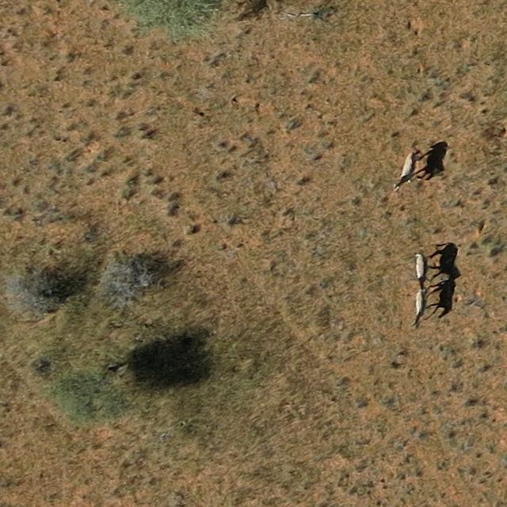

# **DataLabeling for Aerial Wildlife Census**  
**An active learning pipeline for labeling and training YOLO-based detectors on aerial imagery of large herbivores.**  




## **📌 Project Overview**  
This tool facilitates **semi-automated data labeling** for wildlife researchers and ML practitioners working with:  
- **17 target species**: Waterbuck, Buffalo, Bushbuck, Duiker, Giraffe, Impala, Kudu, Nyala, Reedbuck, Roan, Sable, Warthog, Wildebeest, Zebra, Lechwe, Tsessebe.  
- **Annotation types**: Horizontal bounding boxes & keypoints.  
- **Active learning**: YOLO models improve as users label more data (retraining frequency customizable).  

**Key Features**:  
✔️ Integrated with **Label Studio** (user-friendly UI for non-technical researchers)  
✔️ Supports **YOLO-based detection** (Ultralytics) for model-assisted labeling  
✔️ Works with **aerial imagery from savanna biome** (~2.8 cm/pixel resolution)  
✔️ Coming soon: **Pre-trained models** + **Docker deployment**  

---

## **⚙️ Setup Guide**  

### **1. Prerequisites**  
- **OS**: Windows, Mac, or Linux  
- **Anaconda** (recommended) or **Python 3.8+**  
- (Optional) **Docker** (for future simplified deployment)  

### **2. Installation**  

#### **Option A: Conda (Recommended)**  
```bash  
# Clone repo  
mkdir workspace && cd workspace  
git clone https://github.com/FadelMamar/datalabeling.git  
cd datalabeling  

# Create Label Studio environment  
conda env create -f environment_labelstudio.yml  
conda activate label-studio  
pip install -e ./sourcecode  

# Create ML backend environment  
conda env create -f environment_mlbackend.yml  
conda activate label-backend  
pip install -e ./my_ml_backend  
```  

#### **Option B: Docker (Coming Soon)**  
```bash  
docker run -it -p 8080:8080 -v ./labeleddata:/label-studio/data heartexlabs/label-studio:latest  
```  

---

## **🚀 Launching the Tool**  

### **Windows**  
- Launch Label Studio:  
  ```bash  
  .\helper-scripts\run-labelstudio-windows.bat  
  ```  
- Launch ML Backend:  
  ```bash  
  .\helper-scripts\run-ml-backend-windows.bat  
  ```  

### **Linux/Mac**  
```bash  
./helper-scripts/run-labelstudio-linux.sh  
./helper-scripts/run-ml-backend-linux.sh  
```  

Access Label Studio at: **[http://localhost:8080](http://localhost:8080)**  

---

## **🖼️ Annotation Templates**  
Paste these in Label Studio’s **Settings > Labeling Interface**:  

### **Bounding Boxes**  
```xml  
<View>  
  <Image name="image" value="$image"/>  
  <RectangleLabels name="label" toName="image">  
    <Label value="Waterbuck" background="green"/>  
    <Label value="Zebra" background="blue"/>  
    <!-- Add all 17 species here -->  
  </RectangleLabels>  
</View>  
```  

### **Keypoints (Points)**  
```xml  
<View>  
  <KeyPointLabels name="kp-1" toName="img-1">  
    <Label value="Giraffe" background="red"/>  
    <Label value="Buffalo" background="green"/>  
  </KeyPointLabels>  
  <Image name="img-1" value="$img"/>  
</View>  
```  

---

## **🔧 Usage Tips**  
- **Data Format**: Images in YOLO format (`.txt` files per image with `class_id x_center y_center width height`).  
- **Active Learning**: Retrain YOLO after labeling `X` images (set `X` in the config).  
- **Resolution**: Optimal performance at **~2.8 cm/pixel**.  

---

## **🚧 Roadmap**  
- [ ] **Pre-trained YOLO models** for wildlife detection (coming soon).  
- [ ] **Docker support** for one-click deployment.  
- [ ] **Fully automated retraining**.  

---

## **❓ FAQ**  
**Q: How do I add new species?**  
Edit the annotation template in Label Studio and retrain the model.  

**Q: Can I use my own dataset?**  
Yes! Ensure it follows YOLO format and matches the resolution (~2.8 cm/pixel).  

---

## **📜 License**  
*MIT License*  

---

### **Feedback?**  
Open an issue or contact [fadel.seydou@gmail.com].  
